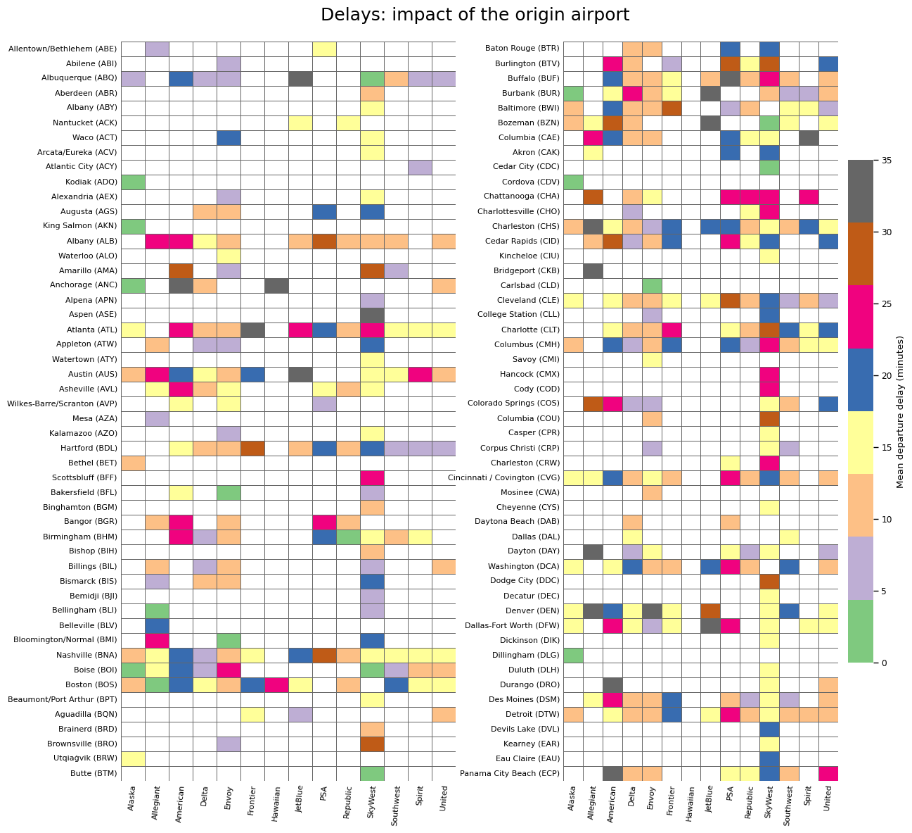

# Airline Operations Analysis

**Using flight data, machine learning and systems thinking to understand airline disruption, delay propagation and operational recovery.**

*Mean departure delay by origin airport and airline — one view into how operational performance emerges from the interaction between network, airport and operator.*

---

## The problem

Airline delays are rarely isolated events.

An aircraft arrives from somewhere else. It has already operated previous sectors. Airports, schedules, turnaround processes, congestion, weather and network structure interact. A delay on one flight can disappear, persist, or propagate through the operation.

This project uses large-scale flight data to explore a practical question:

> **Can we understand where delays originate, how they propagate through an airline operation, and where an airline has meaningful opportunities to intervene?**

The objective is not simply to predict delay.

It is to turn operational data into information that could support **better operational decisions**.

---

## 1. The operating environment matters

The opening heatmap gives an immediate indication of why this is a systems problem.

Departure performance varies between airports — but also between airlines operating from the same airport.

The same origin can produce materially different average departure delays for different operators. Likewise, the same airline experiences very different performance across its network.

So asking:

> **“Which airports cause the most delay?”**

is probably too simple.

More useful questions are:

- Which airport–airline combinations consistently perform poorly?
- Do hub operations behave differently from outstations?
- How much of the apparent airport effect is actually caused by schedule, time of day or network structure?
- Are some airlines better at recovering from difficult operating environments?
- Which factors are actually within the airline's control?

This moves the analysis from simply **describing performance** toward understanding the system producing it.

---

## 2. Following the aircraft

Flights are not independent observations.

An aircraft normally operates a sequence of sectors during the day, creating a physical link between one flight and the next.

I reconstructed aircraft rotations so that the recent operational history of an aircraft could become part of the analysis.

Approximately **97.5% of eligible flight records could be connected into aircraft rotations**.

A strong pattern appears when looking at the previous three sectors:

| Previous 3 sectors delayed | Subsequent late-arrival rate |
|---:|---:|
| 0 | **7.18%** |
| 1 | **15.89%** |
| 2 | **23.95%** |
| 3 | **33.58%** |

Flights following several recently delayed sectors therefore show substantially higher observed late-arrival rates.

This does not establish causation.

It does, however, suggest that **recent aircraft history contains useful information about downstream operational risk**.

---

## 3. Can we predict disruption?

The next question was whether these operational signals could be combined into useful predictive models.

The analysis currently covers approximately **5.7 million US domestic flights**.

### Arrival delay classification

A gradient-boosted classification model was developed to identify flights at risk of late arrival.

| Metric | Result |
|---|---:|
| ROC-AUC | **0.929** |
| PR-AUC | **0.865** |

### Arrival delay regression

A separate model estimates arrival delay in minutes.

| Metric | Result |
|---|---:|
| MAE | **10.7 min** |
| RMSE | **21.6 min** |

These results indicate that the available operational data contains substantial predictive signal.

But prediction is not the end goal.

---

## 4. From prediction to decision

Knowing that a flight is likely to be late only becomes valuable if someone can act on that information.

That introduces what I think of as the **operational locus of control**.

Some decisions are made months before operation:

- network design
- schedule construction
- block times
- aircraft allocation
- turnaround assumptions

Others can be influenced on the day:

- departure readiness
- turnaround recovery
- aircraft swaps
- disruption management
- operational prioritisation

And some important drivers — including weather, airspace restrictions and elements of ATC congestion — sit largely outside the airline's immediate control.

The question therefore changes from:

> **“Can we predict the delay?”**

to:

> **“What can we predict, when can we predict it, who can act on it, and what decision could change the outcome?”**

That is the direction of this project.

---

## Current areas of investigation

The work is continuing across:

- Airport and hub performance
- Airline–airport interactions
- Aircraft rotation reconstruction
- Delay propagation
- Delay recovery
- Route and network effects
- Operational locus of control
- Predictive modelling
- Decision-support concepts

---

## Technical approach

The project combines exploratory analysis, large-scale data processing and machine learning.

**Tools:** Python · PySpark · Databricks · pandas · scikit-learn · MLflow · Matplotlib

The workflow broadly follows:

> **Operational question → Data exploration → Hypothesis → Feature engineering → Modelling → Validation → Operational interpretation**

The emphasis throughout is on understanding the **system**, rather than simply optimising a model metric.

---

## About this project

This is an independent portfolio project using public flight data.

It reflects my broader interest in applying **systems engineering, data analysis and machine learning to complex operational problems** — particularly where analysis and prediction can be connected to a real decision.

The work is ongoing. Findings presented here should be considered exploratory rather than causal conclusions.
